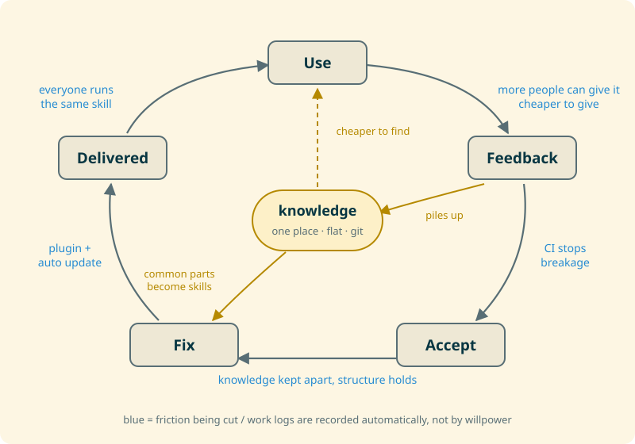

## Thirty percent

At a company of about 50 people, it turns out I was using 30% of all the AI tokens. Over one month, `claude` was launched more than 4,000 times in total, over five times as often as the second-heaviest user. Nobody told me off. These numbers do include `claude` processes started automatically from hooks and the like, not just sessions I typed into (the automatic work log I describe later is one of them).

Honestly, I assumed everyone used about as much. I did not think I was doing anything special either. But if the usage is that lopsided, maybe the things I consider normal are worth sharing. So here they are.

I cannot show the actual plugins, since they are internal, but I package skills that help the team's work into plugins and hand them out. One person started contributing only knowledge, without touching any code, and then finished a task they had never done before on their own, just by running the loop that was handed over.

The conclusion first: the gap is not about how good the tool is. It is about **how fast you can turn the feedback loop (use → feedback → accept → fix → delivered)**. Hand the same tool to a group, and this is where people split into those who stay flat and those who compound. Everything I do comes down to cutting friction somewhere in this loop, and each piece on its own is obvious. Doing the obvious things every single time is what makes the difference.

## It starts with making my own work easier

The first time, I make the AI push through it. The second time, I turn it into a skill so it does better. The third time, better still: it leaves logs, takes feedback, and is shaped so other people can extend it. Once it has grown enough, I put it on automatic runs with `/loop` and the like, and ship it as a plugin.

The third time is what matters. That is when people other than me can get involved. Spreading it to others is a side effect, not the goal. The motive is simply that doing the same thing by hand twice is a loss.

## The friction I cut

| Friction                          | What I do                                                                      |
| --------------------------------- | ------------------------------------------------------------------------------ |
| How many people can give feedback | Separate knowledge from program, so people can contribute without writing code |
| Cost of giving feedback           | A feedback skill that goes from conversation to issue in one step              |
| Speed of accepting changes        | CI before skills, so a machine stops anything that breaks                      |
| Cost of fixing                    | Keep knowledge out of the skill body and hold it together with structure       |
| Time until it reaches people      | Plugin + auto update, so it lands without anyone doing anything                |
| Cost of finding things            | Keep knowledge in one place, flat, in git                                      |
| Gaps in the record                | Record work logs automatically, not by willpower                               |

The main line turns one piece of feedback into one fix. There is a second path too: the common parts of accumulated knowledge come back as new skills. That works even for patterns I have never run into myself.

### More people who can give feedback

Getting more people to write skills only adds. Contributing knowledge, on the other hand, sharpens the judgment of everyone who uses that skill, so it compounds. You can write knowledge without understanding the code.

Handing things out, though, does not make feedback appear on its own.

### Cheaper to give feedback

If it takes a long time from "I should report this" to actually reporting it, the feedback never shows up. The feedback skill fires only under narrow conditions, and when there is nothing to report, returning "nothing" is the correct result.

### CI before skills

Only once breakage is visible can you merge without fear, and hand things to an agent. The line I draw: safety and invariants are guarded by machines, writing conventions by review. Even whether the scripts an agent runs stay read-only is checked by a machine.

### Skills are held together by structure

A skill written without thinking about structure falls apart by the third time and gets thrown away. Move knowledge out of the skill body instead of embedding it. Isolate the work that pollutes context into an agent. Express branching with a facade skill instead of if statements. Keep tests.

My guess is that people whose AI use has plateaued are not so much stuck at the first time as watching their second-time skill collapse on the third and sliding back. This is a hypothesis.

### Ship it as a plugin

People who do not know how to install something will not use it, and will not update it either. Distribution does not end at handing it over; it ends when it is running. A plugin is not installed just by distributing settings.JSON (`enabledPlugins` only holds on/off), so you cannot skip sitting down together for the first ten minutes. After that, with auto update in place, feedback reaches everyone's machine on its own.

### Knowledge in one place, flat, in git

I keep it out of Notion and other external services because it can be version-controlled, I can tweak how it is searched, and it is local and fast (an agent hits it dozens of times).

Knowledge is mostly read by AI, so whether it is easy for a human to read does not matter much. What matters is whether the AI can find it, and I think splitting it into directories buys almost nothing. A hierarchy means deciding where to put each note every time, so I keep it flat and instead use CI to guarantee that everything can be reached through tags, MOCs, and links. In exchange for never thinking about where something goes, I always make the connections.

The idea of separating knowledge from behavior actually came from my personal Obsidian vault. I wrote up the vault's design in [Zettelkasten in Practice Part 1: Design](/en/blog/zettelkasten-operation-part1-design).

### Record automatically

Work you cannot look back on does not become an asset. A Stop hook calls `claude -p` and has it write the session's activity log into my daily note automatically. This is done by [knowledge-gardener](https://github.com/Kohei-Wada/knowledge-gardener), a Claude Code plugin I wrote; its design is in [The plugin holds only WHEN, the vault holds HOW](/en/blog/knowledge-gardener-when-how-separation).

## Move the entrance and exit outside too

Automation only pays off once both its entrance and its exit are moved outside. Even if `/loop` watches a task that waits on someone else, you are still tied down if you have to stare at the screen to know when it finishes. A notification on my phone is enough for the completion report. Once it arrives, nobody has to sit and watch.

Before I set up moshi, I actually had my home Alexa speak the notifications through Home Assistant. That way I hear it anywhere in the house. If even carrying your phone around is a hassle, I recommend this. I wrote up how it works in [I built a way for Claude Code to report progress through my home Alexa](/en/blog/ha-claude-code-alexa-report).

Next is stepping in midway. If I can SSH in from my phone right when the notification arrives, check the agent, or give it a short answer, the loop keeps going without me going back to my desk. I set this up just today, getting into herdr from moshi on a Pixel.

## What I do not do ── no trading trust for speed

Collecting feedback automatically is possible today with the same mechanism as the automatic work log (a Stop hook calling `claude -p`). That is probably the fastest way to turn the loop.

I still do not do it, because it would mean siphoning off other people's sessions, which is basically spyware. Feedback stays something people decide to give. Wear down trust, and feedback stops coming at all.

## Do the obvious things, every time

Writing it all down, there is nothing new here. Add CI, separate knowledge, automate distribution, keep records. Each of these ends with "sure, makes sense" when you hear it.

The only difference, I think, is whether you actually do them every single time.
