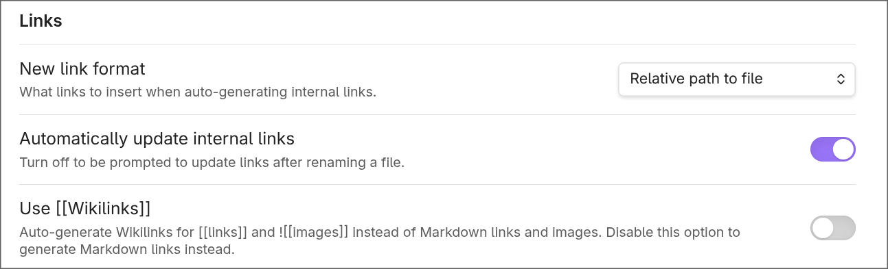
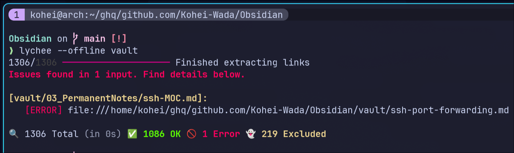
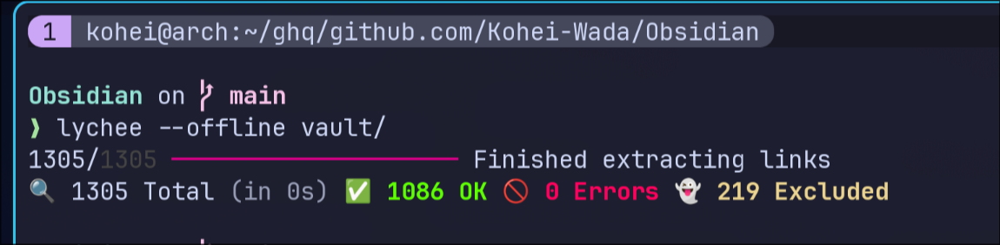

When you manage notes in Obsidian, renaming files or deleting notes can leave broken links behind. In this post, I'll show how to automatically detect them using lychee, a fast link checker written in Rust.

## What is lychee?

[lychee](https://github.com/lycheeverse/lychee) is a fast link checker written in Rust.

**Highlights:**

- Fast checks thanks to async processing
- Native support for Markdown files
- The `--offline` option lets you check only local links
- Easy to plug into GitHub Actions

## Prerequisite: Obsidian link formats

There's an important caveat when using lychee. Obsidian's default wiki-link format `[[note]]` is _not_ supported by lychee. To check links with lychee, you need to use standard Markdown link syntax.

If you flip Obsidian's "New link format" setting to "Relative path", new links will be created in the standard format automatically.



| Format            | Example             | lychee support   |
| ----------------- | ------------------- | ---------------- |
| wiki link         | `[[note]]`          | ❌ Not supported |
| standard Markdown | `[note](./note.md)` | ✅ Supported     |

To convert existing wiki links, plugins like [obsidian-link-converter](https://github.com/ozntel/obsidian-link-converter) come in handy.

## Installation

### macOS (Homebrew)

```bash
brew install lychee
```

### Linux

```bash
curl -sSfL https://github.com/lycheeverse/lychee/releases/latest/download/lychee-x86_64-unknown-linux-gnu.tar.gz | tar xzf - -C /usr/local/bin
```

## Basic usage

To check the internal links of an Obsidian vault, use the `--offline` option:

```bash
lychee --offline vault/
```

### Sample output

When broken links exist, you'll see output like this:



When all links are healthy:



## How to write standard Markdown links

Using relative paths lets lychee detect broken links accurately.

```markdown
[関連ノート](../03_PermanentNotes/related-note.md)

```

**Tips:**

- Use relative paths (`../folder/file.md`)
- Avoid URL encoding (`%20`, etc.)

## Excluding files

In practice, you'll inevitably want to exclude certain files or directories from the check.

### Excluding from the command line

```bash
# Exclude a specific path
lychee --offline --exclude-path "vault/99_Archive" vault/

# Exclude multiple paths
lychee --offline \
  --exclude-path "vault/99_Archive" \
  --exclude-path "vault/.obsidian" \
  vault/
```

### Excluding via .lycheeignore

You can create a `.lycheeignore` file at the project root and list exclusion patterns there:

```
# Exclude archive
vault/99_Archive/

# Exclude templates
vault/98_Templates/

# Exclude files matching a pattern
**/draft-*.md
```

### Managing settings with lychee.toml

Bundling settings into a file is convenient:

```toml
# lychee.toml
exclude_path = [
  "vault/99_Archive",
  "vault/.obsidian"
]

# Timeout (for external URL checks)
timeout = 10

# Concurrency
max_concurrency = 32
```

You can point to the config file when running the command.

```bash
lychee --offline --config lychee.toml vault/
```

## Auto-check with a pre-commit hook

To run a link check automatically on commit, set up pre-commit.

### .pre-commit-config.YAML

```yaml
repos:
  - repo: local
    hooks:
      - id: lychee-link-checker
        name: Check links with lychee
        entry: lychee --offline --config lychee.toml vault/
        language: system
        files: '\.md'
        pass_filenames: false
```

### Installing and enabling pre-commit

```bash
pip install pre-commit
pre-commit install
```

Now link checking runs automatically on every commit, and a commit will be aborted if any broken links are found.

## Continuous checking with GitHub Actions

Running the link check in CI catches problems before a PR is merged.

### .GitHub/workflows/ci.yml

```yaml
name: CI

on:
  push:
    branches: [main]
  pull_request:
    branches: [main]

jobs:
  link-check:
    runs-on: ubuntu-latest
    steps:
      - uses: actions/checkout@v4

      - name: Install lychee
        run: |
          curl -sSfL https://GitHub.com/lycheeverse/lychee/releases/latest/download/lychee-x86_64-unknown-linux-gnu.tar.gz | tar xzf - -C /usr/local/bin

      - name: Run link checker
        run: lychee --offline --config lychee.toml vault/
```

## Running from a Makefile

It's handy to wrap frequently used commands in a Makefile:

```makefile
VAULT_PATH := vault

.PHONY: check-links
check-links:  ## Check for broken links using lychee
 lychee --offline --config lychee.toml $(VAULT_PATH)/
```

```bash
make check-links
```

## Wrapping up

With lychee, you can check an Obsidian vault for broken links quickly and automatically.

| Scenario           | Command                               |
| ------------------ | ------------------------------------- |
| Manual local check | `lychee --offline vault/`             |
| At commit time     | Automatic check via a pre-commit hook |
| CI                 | Continuous checks via GitHub Actions  |

**One thing to keep in mind: lychee only supports standard Markdown links.** If you're using wiki links `[[note]]`, you'll need to convert them to the standard format first.

Keep your knowledge base healthy and free of broken links.

## References

- [lychee - GitHub](https://github.com/lycheeverse/lychee)
- [lychee Documentation](https://lychee.cli.rs/)
- [pre-commit](https://pre-commit.com/)
- [obsidian-link-converter](https://github.com/ozntel/obsidian-link-converter)
