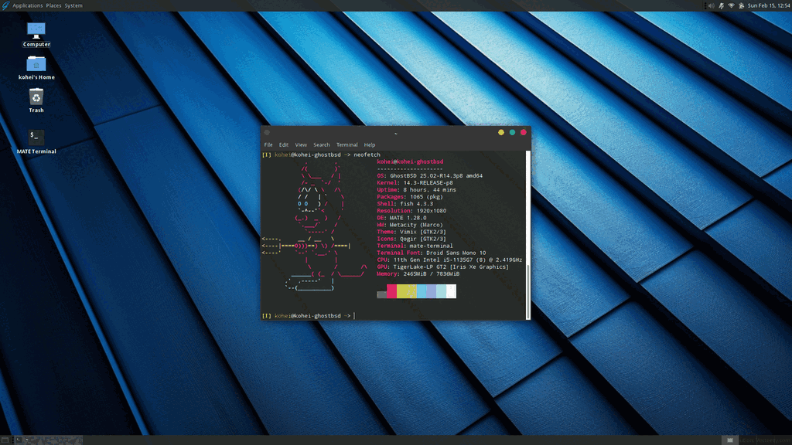
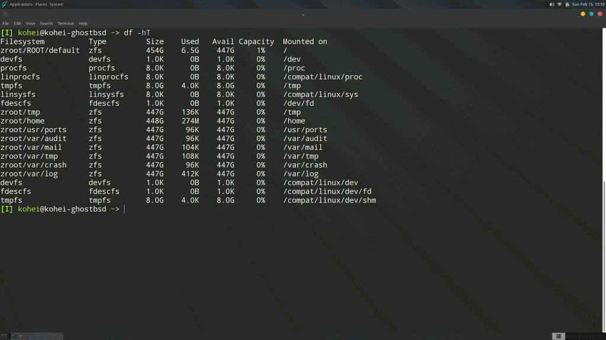
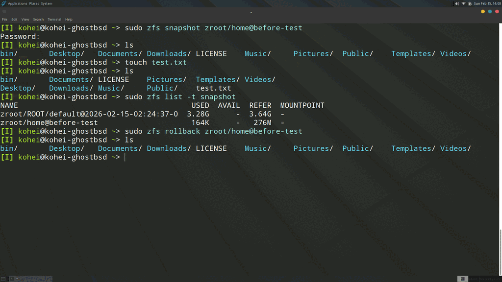
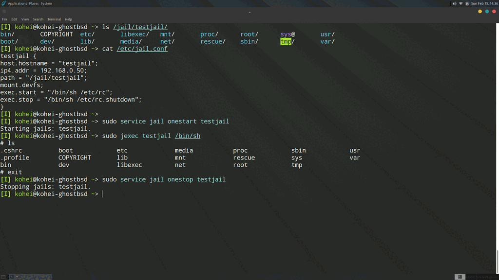

I had some free time, and I vaguely remembered installing GhostBSD once before but giving up because I had no idea how to use it. These days I can just ask an AI, so I figured it would be fun to give it another shot.

## Installation

Just create a bootable USB and boot from it.
Download the ISO from the [GhostBSD download page](https://www.ghostbsd.org/download) and write it to a USB stick.
I did this from Linux — be careful, because if you pick the wrong device, you're toast.

```bash
lsblk # check which device you're writing to
sudo dd if=GhostBSD-25.02-R14.3p2.iso of=/dev/sda bs=4M status=progress oflag=sync
```

Boot it up! Looks pretty sharp.
And the default shell is fish, which feels surprisingly modern.
I had this image of BSD being old and crusty, but this is nothing like what I expected.



## Getting sshd up and running

### Starting sshd

Poking at the desktop with a mouse is a hassle, so I want to get SSH working and access the shell from my main machine.
(I'm taking the screenshots in this post from the actual desktop, though. Because it looks cool.)
The sshd config itself is the same as on Linux, but to check whether a port is open you use `sockstat`.

```bash
sudo service sshd start
sockstat -l # the equivalent of `ss -tln` on Linux

```

The equivalent of `systemctl enable sshd` is done by editing `/etc/rc.conf`.

```bash
sshd_enable="YES"
```

Check it's running with:

```bash
sudo service sshd status
sudo service -e | grep sshd # confirm it's enabled
```

### Configuring the firewall

Even after starting sshd, the firewall was blocking everything, so I had to open a hole.
GhostBSD uses something called `ipfw` for its firewall.

```bash
sudo ipfw add 150 allow tcp from any to me 22 # temporary — gone after reboot
```

To make it persistent, add the following to `/etc/rc.conf`.
Apparently at boot time `rc.conf` gets expanded and the `ipfw` rules are auto-generated and applied.

```bash
firewall_myservices="22/tcp"
firewall_allowservices="<IP>"
```

With this I could SSH in, which made things much easier.

## Desktop settings

Since I installed this on a laptop, closing the lid would sometimes kill sshd.
I disabled suspend-on-lid-close with:

```bash
gsettings set org.mate.power-manager button-lid-battery "'nothing'"
gsettings set org.mate.power-manager button-lid-ac "'nothing'"
```

Then I set up devd to lock the screen when the lid closes.

```bash frame="terminal"
cat <<EOF | tee /usr/local/sbin/lid-desktop.sh
#!/bin/sh
sleep 1
if [ "$(sysctl -n dev.acpi_lid.0.state)" = "0" ]; then
  logger -t lid-desktop "Lid closed, locking screen"
  su - kohei -c "DISPLAY=:0 mate-screensaver-command -l"
fi
EOF

chmod +x /usr/local/sbin/lid-desktop.sh

sudo tee /usr/local/etc/devd/lid-desktop.conf << 'EOF'
notify 10 {
    match "system"          "ACPI";
    match "subsystem"       "Lid";
    match "notify"          "0x00";
    action "/usr/local/sbin/lid-desktop.sh";
};
EOF
sudo service devd restart
```

At this point things were already pretty usable.
I don't know MATE all that well, so there may be better ways to set this up, but it works for now.
I'll keep tinkering with the desktop side over time.

## ZFS blew my mind

While poking around with whatever Linux commands I knew, I ran `df -h` and was stunned by the output. There were tons of 447GB filesystems.
There's obviously no way I actually have that many 447GB disks, but it kind of felt like my storage had ballooned, which made me weirdly happy!



This is ZFS — a filesystem that isn't merged into Linux for licensing reasons.
(ZFS's CDDL and Linux's GPL are apparently incompatible.)
Compared to `ext4`, which is commonly used on Linux, ZFS has the following characteristics:

| Item                 | ext4                   | ZFS                                     |
| -------------------- | ---------------------- | --------------------------------------- |
| Type                 | Filesystem only        | Filesystem + volume manager             |
| Write method         | Overwrite (journaling) | Copy-on-write                           |
| Corruption detection | Not supported          | Checksums for detection and auto-repair |
| Snapshots            | Not supported          | Native support                          |
| RAID                 | Needs mdadm or similar | Built in                                |
| Compression          | Not supported          | Supported                               |
| Memory usage         | Low                    | High                                    |

The fact that you can manage the filesystem with just two commands, `zfs` and `zpool`, and that you get snapshots and RAID for free, is amazing!
I gave snapshots a quick try.

```bash
sudo zfs snapshot zroot/home@before-test # create snapshot
sudo zfs list -t snapshot # check
sudo zfs rollback zroot/home@before-test # roll back!
```



Wow. It really did restore everything....

## Trying out jails

One of BSD's nice features is something called jails.
It's the ancestor of container tech like Docker. Setting one up is a bit tedious — you have to extract a `tar` archive yourself — but the upside is that it's implemented entirely in the kernel, so you don't need a `dockerd` running.
Well, podman might be able to do similar things, but still....

Let's give it a shot.

```bash
### Create the base system
mkdir -p /jail/testjail
fetch https://download.freebsd.org/releases/amd64/14.0-RELEASE/base.txz
tar -xf base.txz -C /jail/testjail

### Copy DNS info
cp /etc/resolv.conf /jail/testjail/etc/

### Create config
cat <<EOF | tee /etc/jail.conf
testjail {
    host.hostname = "testjail";
    ip4.addr = "192.168.1.100";
    path = "/jail/testjail";
    mount.devfs;
    exec.start = "/bin/sh /etc/rc";
    exec.stop = "/bin/sh /etc/rc.shutdown";
}
EOF

### Start it
service jail onestart testjail

### Get a shell inside the jail
jexec testjail /bin/sh

### Stop it
service jail onestop testjail

```



It's basically Docker....
Now that I've tried it, getting into the container is so easy that it doesn't really feel isolated.
And the config is a bit of a pain. (Apparently a tool called `bastille` makes this easier, so I'll try that next.) Dockerfiles really are convenient, I have to admit.

## Things that surprised me

- The packages are newer than I expected. `pkg install neovim` got me nvim 0.11.6, and the default shell being fish gives the same impression — they're keeping up with newer software. Possibly even more current than Ubuntu.
- ZFS is incredible. Snapshots are instant. You could easily try something out and then throw it away. I wonder if it could even replace full DB backups...?
- The system feels simpler than Linux. From my limited experience, system-level settings like the firewall and sshd config all seem to live in one place: `/etc/rc.conf`.
  Linux only really manages the kernel and device drivers, so userland ends up feeling like a patchwork of assorted packages. BSD manages userland as part of the OS too, and I think that's where this cohesive feel comes from.

## Things that were so-so

- Wi-Fi feels unstable. It keeps dropping. There's a good chance this is just me not understanding the config.
- Unlike systemd, it doesn't really manage daemon dependencies for you, so startup order matters quite a bit. Again, this could just be me not understanding the config....

## Wrapping up

- I think I'll keep using GhostBSD as my secondary machine.
- Since I normally only use Linux, this felt like traveling to a foreign country — it was fun.
- ZFS is supposedly great for NAS use, so I might try that as a way to learn more BSD.
- macOS's userland is BSD-based, so this might double as practice for that.
- I've barely used fish, so this is a nice place to play with it (I normally use bash).
