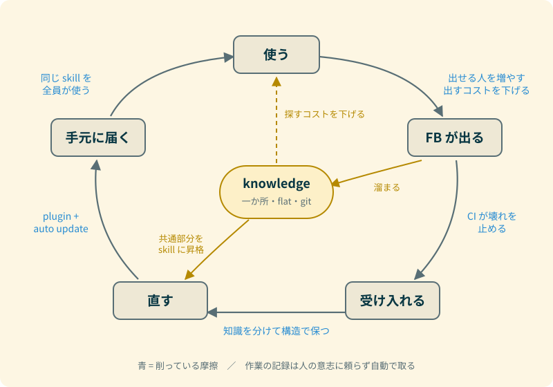

## 3割だった

50人ほどの会社で、社内の AI のトークン使用量のうち、3割を自分が使っていたらしい。`claude` の起動回数は1か月で合計4000回を超えていて、2番目に使っている人の5倍以上だった。別に怒られたわけではない。起動回数の大半は、フックから自動で起動している `claude`（後で書く作業ログの自動記録）の分だ。ただしトークンで見ると自動記録の分は2%にも満たず、3割のほとんどは自分の対話が食っている。

正直、みんな同じくらい使っていると思っていた。やっていることも特別だとは思っていなかった。ただ、偏りがそれだけあるなら、自分が普通だと思ってやっていることは共有したほうがいいのかもしれない。なので書いておく。

具体的な plugin は社内のものなので見せられないが、チームの作業を助ける skill を plugin にして配っている。コードを一切触らず knowledge だけを書いて貢献する人も出てきて、その人は経験の無い作業を、渡したループを回すだけで一人でやり切った。

先に結論を書くと、差がつくのは道具の性能ではない。**FB ループ（使う → FB が出る → 受け入れる → 直す → 手元に届く）をどれだけ速く回せるか**だと思っている。同じ道具を配られても、ここで横ばいの人と複利で伸びる人に分かれる。やっていることは全部、このループのどこかの摩擦を削る話で、一つ一つは当たり前だ。当たり前のことを常にやっている、というのが差になっているのだと思う。

## 起点は自分の作業を楽にすること

1回目は AI に頑張ってやらせる。2回目は skill にして、もっとうまくやらせる。3回目はさらにうまく、ログを残し、FB を受け、他の人が拡張できる形にする。十分育ったら `/loop` などで自動実行に乗せ、plugin にして配る。

大事なのは3回目だ。ここで初めて、自分以外の人が関われるようになる。横展開は目的ではなく副産物で、動機は「同じことを手で2回やったら負け」というだけだ。

## 削っている摩擦

| 削る摩擦             | やっていること                                                          |
| -------------------- | ----------------------------------------------------------------------- |
| FB を出せる人の数    | knowledge と program を分けて、コードが書けなくても貢献できるようにする |
| FB を出すコスト      | FB 用の skill で、会話から issue 化までを一発にする                     |
| 受け入れの速さ       | skill より先に CI を入れて、壊れたら機械が止める                        |
| 直すコスト           | 知識を skill 本体から分けて、構造で保つ                                 |
| 手元に届くまでの時間 | plugin + auto update で、本人が何もしなくても反映される                 |
| 探すコスト           | knowledge を一か所・flat・git に置く                                    |
| 記録の抜け           | 作業のログを、人の意志に頼らず自動で取る                                |

本線は「1件の FB を1件の修正にする」だ。もう一つの経路として、溜まった knowledge の共通部分が新しい skill になって戻ってくる。自分が一度も踏んでいない型でも、skill にできる。

### FB を出せる人を増やす

skill を書ける人を増やすのは足し算だ。一方、knowledge への貢献は、その skill を使う全員の判断の精度を上げるので、複利になる。コードが分からなくても knowledge は書ける。

ただ、配っただけでは FB は湧いてこない。

### FB を出すコストを下げる

FB は「出そうと思ってから出すまで」が長いと出てこない。FB 用の skill は発火の条件を絞り、FB が無いときは「無し」と返すのが正しい結果、という設計にしている。

### skill より先に CI

壊れたら分かる状態があって初めて、怖がらずにすぐ merge できるし、agent にも任せられる。線の引き方は「安全と不変条件は機械で守る、文章の規約はレビューで守る」。agent が実行するスクリプトが read-only のままかどうかも、機械で検査している。

### skill は構造で保つ

構造を考えずに書いた skill は、3回目で崩れて捨てられる。知識を skill 本体に埋め込まずに knowledge へ逃がす。context を汚す処理は agent に隔離する。分岐を if 文ではなくファサードの skill で表す。tests を置く。

AI 活用が横ばいの人は、1回目で止まっているというより、「2回目の skill が3回目で崩れて元に戻っている」ことが多いのではないか、と思っている。これは仮説だ。

### 配る単位は plugin

install の方法が分からない人は使わないし、更新もしない。配布は「渡す」ではなく「動く状態にする」までだ。plugin は settings.JSON を配るだけでは入らない（`enabledPlugins` は on/off しか持たない）ので、最初の10分を一緒に座ってやる工程は省けない。そこで auto update まで入れておけば、それ以降は FB が勝手に全員の手元に届く。

### knowledge は一か所・flat・git

Notion などの外部に出していないのは、バージョン管理ができる、検索方法を自分でいじれる、local なので速い（agent は何十回も引く）からだ。

knowledge を読むのは基本的に AI なので、人間にとって読みやすいかどうかは重要ではない。大事なのは AI が見つけやすいかどうかで、ディレクトリで分ける意味はほとんど無いと思っている。階層を作ると「どこに置くか」を毎回考えることになるので flat にして、その代わりにタグ・MOC・リンクで引けることを CI で担保している。置き場所を考えない代わりに、つながりは必ず作る。

知識と動作を分けるという考え方は、実は個人の Obsidian vault から着想を得たものだ。vault の設計は [Zettelkasten 運用記録 Part 1: 設計編](/ja/blog/zettelkasten-operation-part1-design) に書いた。

### 記録を自動で取る

後から振り返れない作業は資産にならない。Stop フックから `claude -p` を呼んで、セッションの活動ログを daily note に自動で書かせている。これは自作の Claude Code plugin の [knowledge-gardener](https://github.com/Kohei-Wada/knowledge-gardener) でやっていて、設計は [Plugin は WHEN だけ、vault は HOW を持つ](/ja/blog/knowledge-gardener-when-how-separation) に書いた。

## 入口と出口も外に出す

自動化は、入口と出口の両方を外に出して初めて効く。相手の準備ができるのを待つ作業を `/loop` に監視させても、完了を知るために画面を見張っていたら、結局は拘束される。完了の報告はスマホへの通知で足りる。届けば、人は張り付かなくてよくなる。

実は moshi を入れる前は、自宅の Home Assistant 経由で Alexa に喋らせて通知していた。これなら家のどこにいても分かる。スマホを持ち歩くのも面倒なら、こちらがおすすめだ。仕組みは [Claude Code に自宅 Alexa で進捗報告させる仕組みを作った](/ja/blog/ha-claude-code-alexa-report) に書いた。

その次は途中の介入だ。通知を受けたその場で、スマホから SSH で入って agent の状態を見たり、短く答えたりできれば、机に戻らなくてもループは止まらない。これは今日、Pixel の moshi から herdr に入れるようにしたところだ。

## やらないこと ── 速さのために信頼は削らない

FB の自動収集は、作業ログの自動記録と同じ仕組み（Stop フックから `claude -p`）で、今日でもできる。ループを最速にする方法はたぶんこれだ。

それでもやらないのは、他の人のセッションを吸い上げる形になって、スパイウェアのようになるからだ。FB は本人が「出す」と決めて出すものにしておく。信頼を削ると、そもそも FB が出てこなくなる。

## 当たり前を常にやる

書き出してみると、新しいことは一つもない。CI を入れる、知識を分ける、配布を自動にする、記録を取る。どれも聞けば「そうだね」で終わる話だ。

差がついているのは、それを毎回やっているかどうかだけなのだと思う。
