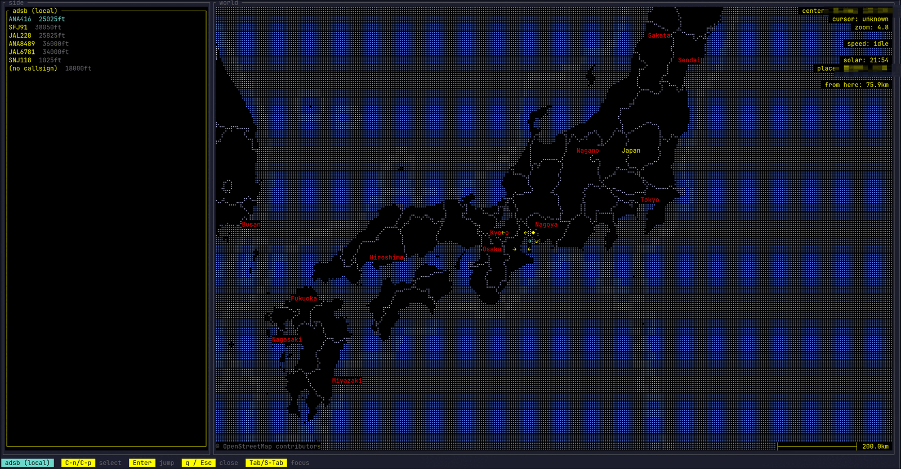
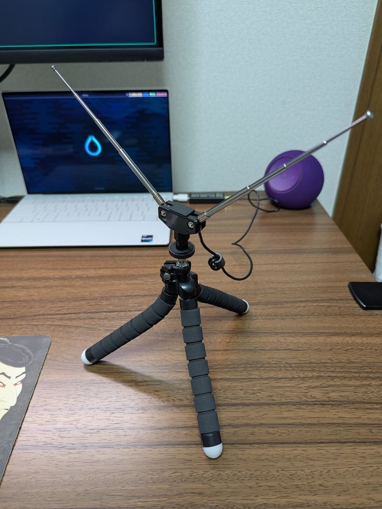

## 自分で受信したくなった

前に [ターミナルの中で地球儀を回す ttymap](/ja/blog/ttymap-terminal-scriptable-globe) を作った話を書いた。braille 文字の地球儀に、上空を飛ぶ飛行機やら地震やら ISS やらを重ねて眺めるやつだ。その「飛行機」を出す `aircraft` プラグインは、OpenSky Network の公開 ADS-B フィードを叩いていた。便利なんだけど、要するに**誰かのサーバが受信して整形した結果**を眺めているだけだ。



頭上を飛んでいる飛行機が出す電波は、今まさに自分の部屋にも降ってきている。だったら自分のアンテナで受信して、自分の地球儀に出したい。受信専用の RTL-SDR なら技適も要らない。ドングルとダイポールアンテナを買った。

この記事は、そのドングルを挿してから、自作地球儀に「自分で受信した飛行機」が舞うまでの記録。

## 挿したら TV チューナーだった

USB に挿して `lsusb` を見ると、こう出る。

```text
Bus 003 Device 007: ID 0bda:2838 Realtek Semiconductor Corp. RTL2838 DVB-T
```

`DVB-T`。デジタル**地上波テレビ**チューナーだ。それもそのはず、RTL-SDR の中身の RTL2832U チップは、元々「安い USB 地デジチューナー」として大量に売られていた製品で、後から「復調前の生の I/Q サンプルを吐かせれば任意の電波を受信できる＝ SDR になる」と発見されて第二の人生を歩んでいる。

なので Linux カーネルは、挿した瞬間にこいつを**TV チューナーとして**掴む。`dvb_usb_rtl28xxu` というドライバだ。これが問題で、

```text
            ┌─ dvb_usb_rtl28xxu (カーネル/TV用)   ← 掴むと SDR で開けない
RTL2832U ───┤
            └─ librtlsdr (ユーザー空間/SDR用)      ← 受信に使いたいのはこっち
```

1 つのデバイスを 2 つのドライバが同時には掴めない。SDR として使うには、TV ドライバに掴ませないよう blacklist する。Arch の `rtl-sdr` パッケージは、ありがたいことに `/usr/lib/modprobe.d/rtlsdr.conf` でこれを最初からやってくれる。

```text
blacklist dvb_usb_rtl28xxu
blacklist e4000
blacklist rtl2832
```

`rtl_test` でドングルとチューナーの型式を確認する。

```text
$ rtl_test -t
Found 1 device(s):
  0:  Realtek, RTL2838UHIDIR, SN: 00000001
Found Rafael Micro R820T tuner
```

R820T。1090MHz まで届くので ADS-B(1090MHz) はちゃんと拾える。ハードは生きている。

## 生フレームは拾える。でも座標じゃない

ADS-B を一番手軽に拾うには、`rtl-sdr` パッケージ同梱の `rtl_adsb` を叩くだけでいい。

```text
$ rtl_adsb
*8d8622ae58c906dd3078d6822f73;
*8d84b7b699088411219a359bb254;
*8d9632ae58c906dd...;
...
```

`*8d` で始まる行が DF17（ADS-B Extended Squitter）、位置や速度を運ぶ本命メッセージだ。20 秒で 30 本以上、複数機ぶん降ってくる。ダイポール → R820T → librtlsdr の受信チェーンは通った。

……が、これは座標ではない。生の Mode-S フレームだ。ここから緯度経度を出すには **CPR（Compact Position Reporting）デコード**という一段が要る。

なぜ生の lat/lon がそのまま入っていないのか。ADS-B は 1 メッセージ 112 ビットしかなく、緯度経度をフル精度で毎回詰めると帯域が足りない。そこで CPR は、緯度経度を「even フレーム」と「odd フレーム」の 2 種類に分割してエンコードする。**even と odd のペアが揃えば**地球上のどこでも一意に復元できる（グローバルデコード）。あるいは**受信機のだいたいの位置がわかっていれば**、1 フレームだけでローカルに復元できる。後者の方が実装が楽だ。受信機（自宅）の座標はわかっているので、こっちを使う。

CPR を手で書くのはしんどいので、pure Python の [pyModeS](https://github.com/junzis/pyModeS) に投げる。v3 はメッセージ 1 本を渡すと全フィールドを dict で返す API になっていて、`reference` に受信機の概略座標を渡すとローカルデコードしてくれる。

```python
import pyModeS as pms
r = pms.decode(msg, reference=(MY_LAT, MY_LON))
# r["latitude"], r["longitude"], r["altitude"], r["callsign"], r["crc_valid"] ...
```

`rtl_adsb` の出力をこれに流すだけの小さなスクリプトを書いて回すと、ターミナルに座標が流れ始める。

```text
21:29:39  89912B  EVA195    lat=  34.8097  lon= 136.9325  alt=37975ft
21:29:39  851826  JAL229    lat=  34.5754  lon= 136.7913  alt=27600ft
21:29:50  861F00  JAL616    lat=  34.3943  lon= 136.7036  alt=41000ft
```

便名・ICAO アドレス・緯度経度・高度。同じ機体の座標が連続で滑らかに動く（JAL616 が南下、JAL229 が降下中）ので、デコードは正しい。自分のアンテナで受信した実物の飛行機が、座標になった。

## ttymap に流し込む ── 間に JSON サーバを噛ませる

さて、これを自作地球儀 ttymap に乗せたい。ttymap のプラグインがデータを取り込む口は `ttymap.http:fetch(url)` ── つまり **HTTP で JSON を取る**のが基本だ。前編の `aircraft` プラグインも、OpenSky の REST API を `http:fetch` して `map:point(lon, lat, …)` で点を打っていた。

ところがこっちの `rtl_adsb | pyModeS` はテキストを標準出力に吐くだけで、HTTP の口がない。形が合わない。

そこで間に小さな橋を渡す。`rtl_adsb` を子プロセスで回し、pyModeS でデコードした機体状態を ICAO ごとに保持して、`127.0.0.1:8888/aircraft.json` で配るだけの HTTP サーバを Python の標準ライブラリで書いた。

```text
rtl_adsb ──▶ serve.py (pyModeS でデコード + 機体状態を保持) ──HTTP /aircraft.json──▶ ttymap
```

ポイントは、デコーダを「1 フレーム → 1 行 print」から「ICAO ごとに状態を蓄積する」形に変えたこと。位置は位置メッセージ、便名は識別メッセージ、針路は速度メッセージ（velocity の `track`）と、別々のメッセージから少しずつ届くので、機体ごとにレコードを育てて、一定時間聞こえなくなったら捨てる。配る JSON はこんな形にした。

```json
{
  "aircraft": [
    {
      "icao": "861f00",
      "callsign": "JAL616",
      "lat": 34.39,
      "lon": 136.7,
      "alt": 41000,
      "heading": 182.8,
      "on_ground": false
    }
  ]
}
```

## プラグインを書く ── 針路は矢印で

ttymap のユーザープラグインは `~/.config/ttymap/lua/plugin/<name>.lua` に置いて、`~/.config/ttymap/init.lua` で `require "plugin.<name>"` すれば有効になる。中身は bundled の `aircraft` プラグインをほぼそのまま下敷きにして、取得先だけローカルサーバに差し替えた。

肝は `on_tick`（毎フレーム呼ばれる）の中で、一定間隔ごとに `http:fetch` を投げ、返ってきた JSON をパースして点を打つところ。表示は前編の `aircraft` と揃えて、針路を 8 方位の矢印（↑↗→↘↓↙←↖）にした。

```lua
local ARROWS = { "↑", "↗", "→", "↘", "↓", "↙", "←", "↖" }
local function heading_arrow(deg)
    local n = deg % 360
    return ARROWS[math.floor((n + 22.5) / 45) % 8 + 1]
end

-- on_tick の中で:
for i, a in ipairs(state.aircraft) do
    map:point(a.lon, a.lat, heading_arrow(a.heading), "accent")
end
```

サイドバーには便名と高度を並べ、選んで Enter を押すとその機体に地図が寄る（`anim.fly_to`）。このへんのカード UI も `ttymap.api.card.open` に乗せるだけで、前編で作った仕組みがそのまま効く。

## 自分の電波が地球儀に舞う

サーバを起動して、ttymap のコマンドパレットから `Toggle local ADS-B` を呼ぶと、自宅上空に矢印が現れる。針路の向きに矢印が傾き、便名を選べばその機にカメラが寄る。OpenSky という**誰かのサーバ**を見ていたものが、**自分が立てたアンテナで受信した電波**に変わった。同じ braille の地球儀の上で。



地味に面白かったのは受信距離だ。屋内の安物ダイポールを窓際で V 字に開いただけでも、高々度の巡航機なら 100km 前後先までは拾えた。さすがに画面いっぱいに散らばるほどではなく、近隣を飛ぶ機影が地図上にぽつぽつ並ぶ程度だが、それでも「自分のアンテナで届く範囲」が目で見えるのは面白い。

## ハマりどころまとめ

- **挿したら DVB-T チューナーとして認識される。** カーネルの TV ドライバ（`dvb_usb_rtl28xxu`）を blacklist しないと SDR で開けない。Arch の `rtl-sdr` パッケージは modprobe.d でやってくれる。
- **生フレームは座標じゃない。** ADS-B の位置は CPR でエンコードされていて、even/odd ペアか受信機位置の参照が要る。pyModeS に投げるのが楽。
- **ttymap の取り込み口は HTTP JSON。** 標準出力に吐くだけのデコーダは、間にローカル HTTP サーバを噛ませて形を合わせる。

## この先

受信専用でここまで遊べた。次の発展候補としては、複数アンテナでコヒーレント受信して**電波の方位（DF）**を出し、地図に方位線を引いて 2 局の交点から発信源を割り出す ── みたいな方向（KrakenSDR 等）が面白そうだ。`map:polyline` は前編で traceroute のホップに使ったプリミティブがそのまま使える。

自分のツールに、自分で受信したデータを流せると、世界の解像度が一段上がる。
