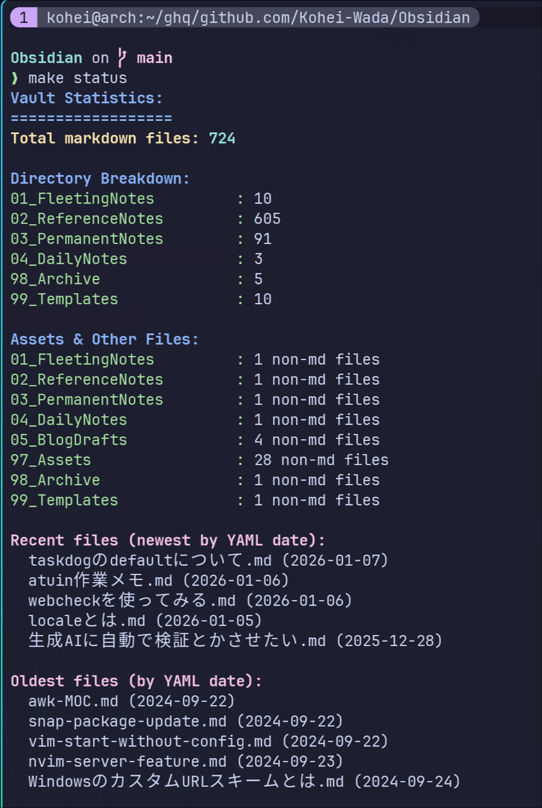
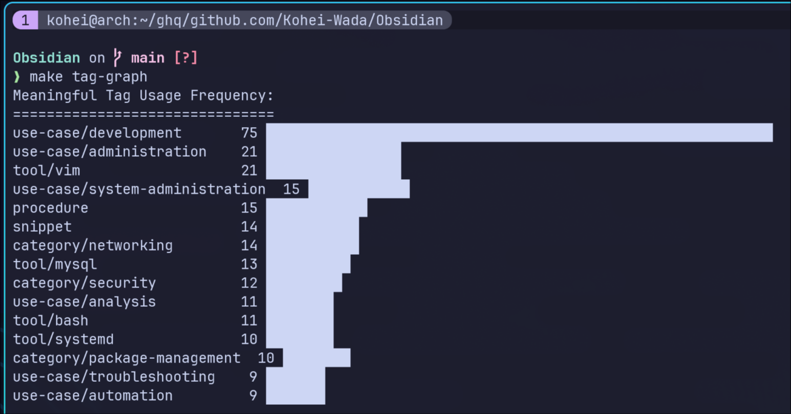
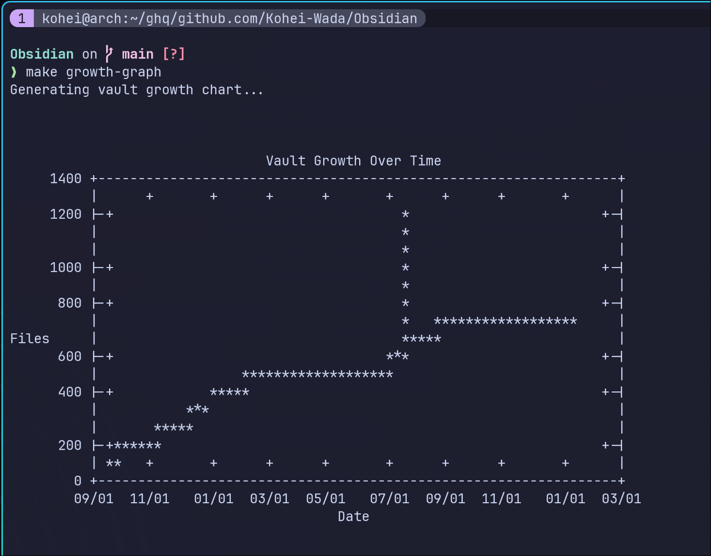
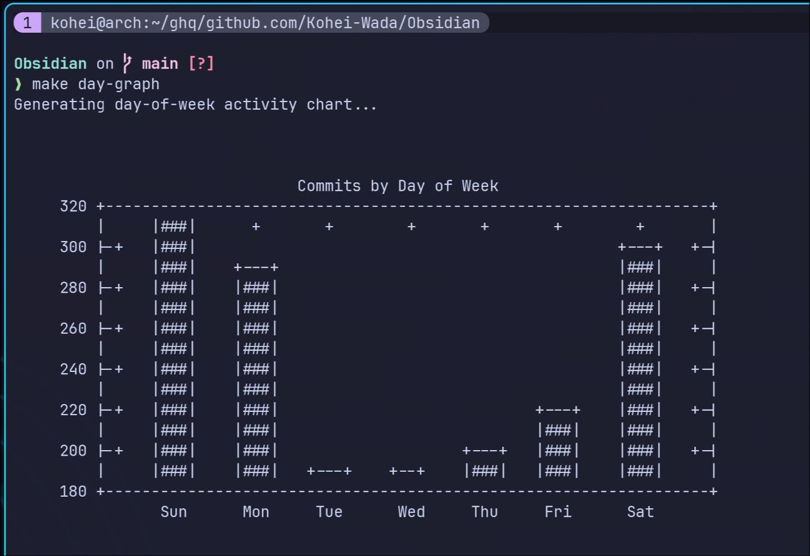
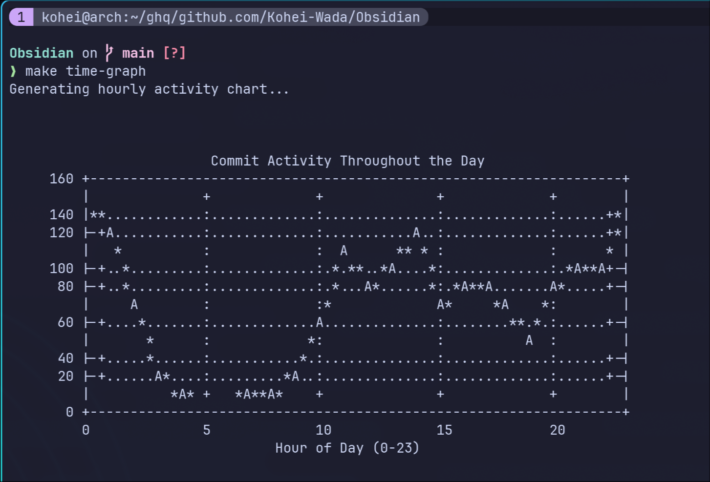
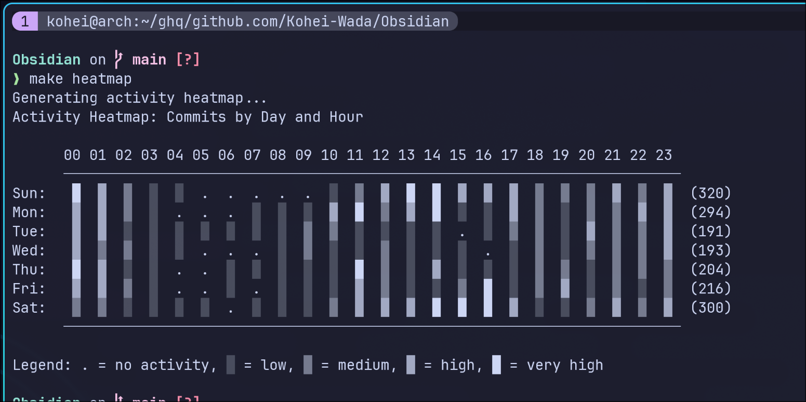

[Part 1（設計編）](/blog/zettelkasten-operation-part1-design/)ではフォルダ構造とタグ設計について書きました。今回は分析編です。

正直に言うと、この記事で紹介する内容は**なくても困りません**。ただ、自分の活動を可視化するのが好きで、気づいたら Makefile にいろいろ生えていました。

---

## なぜ分析するのか

必要だからではありません。好きだからです。

- 自分がいつ集中しているのか見たい
- どのトピックにノートが偏っているか知りたい
- グラフが出ると嬉しい

実用的な理由を挙げるなら、「どのトピックが溜まってきたか」がわかると、ブログ記事にしやすいノートを見つけやすくなります。でも本音は、分析基盤を作ること自体が楽しいだけです。

---

## Makefile の全体像

ナレッジベースの管理用に Makefile を作っています。`make help` で使えるコマンドが一覧表示されます。

```makefile
VAULT_PATH := vault

.PHONY: help status tag-graph day-graph time-graph heatmap

help:  ## Show this help message
    @grep -E '^[a-zA-Z_-]+:.*?## .*$' $(MAKEFILE_LIST) | sort | \
    awk 'BEGIN {FS = ":.*?## "}; {printf "\033[36m%-25s\033[0m %s\n", $1, $2}'
```

以下、いくつかのコマンドを紹介します。

---

## ノート数の統計

`make status` で vault 全体の統計を表示します。

```makefile
status:  ## Show vault status
    @echo "Vault Statistics:"
    @echo "=================="
    @echo "Total markdown files: $(find $(VAULT_PATH) -name "*.md" | wc -l)"
    @echo ""
    @echo "Directory Breakdown:"
    @for dir in $(find $(VAULT_PATH) -maxdepth 1 -type d ! -path $(VAULT_PATH) | sort); do \
        basename=$(basename "$dir"); \
        count=$(find "$dir" -name "*.md" 2>/dev/null | wc -l); \
        if [ "$count" -gt 0 ]; then \
            printf "%-25s: %d\n" "$basename" "$count"; \
        fi; \
    done
```

フォルダごとのノート数がわかります。Reference Notes が増えすぎていたら、MOC を作るタイミングかもしれません。



---

## タグの偏り分析

`make tag-graph` でよく使うタグを可視化します。

```makefile
tag-graph:  ## Meaningful tag usage with ASCII bar chart
    @echo "Tag Usage Frequency:"
    @echo "===================="
    @find $(VAULT_PATH) -name "*.md" -type f -exec grep -A 20 "^tags:" {} \; 2>/dev/null | \
    grep "^  - " | sed 's/^  - //' | \
    grep -v -E '^(reference_note|permanent_note|fleeting_note)$' | \
    sort | uniq -c | sort -nr | head -15 | \
    awk '{count=$1; tag=$2; bar=""; for(i=0;i<int(count*40/50);i++) bar=bar"█"; printf "%-25s %3d %s\n", tag, count, bar}'
```

どのトピックにノートが集中しているかがわかります。バーが長いタグは、ブログ記事のネタになりやすいトピックです。



---

## ノート数の推移グラフ

`make growth-graph` も気に入っています。vault のノート数がどう増えてきたかを時系列で表示します。

```makefile
growth-graph: ## Show markdown file count growth over time (ASCII graph)
    @git log --pretty=format:"%H %ad" --date=short --reverse | \
    xargs -P 8 -I {} sh -c 'echo $(echo "{}" | cut -d" " -f2-),$(git ls-tree -r $(echo "{}" | cut -d" " -f1) --name-only | grep -c "\.md$")' | \
    gnuplot -e "set terminal dumb 80 24; set datafile separator ','; set xdata time; set timefmt '%Y-%m-%d'; set format x '%m/%d'; set xlabel 'Date'; set ylabel 'Files'; set title 'Vault Growth Over Time'; plot '/dev/stdin' using 1:2 with lines notitle"
```

コミットごとの Markdown ファイル数を集計して、成長曲線を描きます。ノートが順調に増えているのを見ると、続けるモチベーションになります。



---

## 曜日別の活動量

`make day-graph` で曜日ごとのコミット数を表示します。gnuplot で ASCII グラフを生成しています。

```makefile
day-graph:  ## Gnuplot bar chart of commits by day of week
    @git log --pretty=format:"%ad" --date=format:"%w" | sort | uniq -c | \
    awk '{days[$2]=$1} END {for(i=0;i<=6;i++) printf "%d %s %d\n", i, \
    (i==0?"Sun":i==1?"Mon":i==2?"Tue":i==3?"Wed":i==4?"Thu":i==5?"Fri":"Sat"), \
    (days[i]?days[i]:0)}' | \
    gnuplot -e "set terminal dumb 80 20; set style data histogram; \
    set title 'Commits by Day of Week'; plot '/dev/stdin' using 3:xtic(2) notitle"
```

自分の場合、平日より週末のほうがコミットが多いことがわかりました。仕事終わりは疲れていて、あまりノートを書いていないようです。



---

## 時間帯別の活動量

`make time-graph` が一番気に入っています。時間帯ごとのコミット数を表示します。

```makefile
time-graph:  ## Gnuplot line chart of commits by hour
    @git log --pretty=format:"%ad" --date=format:"%H" | sort | uniq -c | \
    awk '{hours[$2]=$1} END {for(i=0;i<=23;i++) printf "%d %d\n", i, \
    (hours[sprintf("%02d",i)]?hours[sprintf("%02d",i)]:0)}' | \
    gnuplot -e "set terminal dumb 80 20; set xlabel 'Hour (0-23)'; \
    set title 'Commit Activity by Hour'; plot '/dev/stdin' using 1:2 with linespoints notitle"
```

朝型か夜型か、自分の集中できる時間帯が見えてきます。



---

## 曜日×時間のヒートマップ

`make heatmap` で曜日と時間帯の2軸でコミット頻度を可視化します。

```makefile
heatmap:  ## Activity heatmap showing day of week vs hour
    @git log --pretty=format:"%ad" --date=format:"%w %H" | \
    awk '{day_hour[$1 " " $2]++; if(day_hour[$1 " " $2] > max) max = day_hour[$1 " " $2]} END { \
        days[0]="Sun"; days[1]="Mon"; days[2]="Tue"; days[3]="Wed"; \
        days[4]="Thu"; days[5]="Fri"; days[6]="Sat"; \
        print "Activity Heatmap: Commits by Day and Hour"; \
        print ""; \
        printf "      00 01 02 03 04 05 06 07 08 09 10 11 12 13 14 15 16 17 18 19 20 21 22 23\n"; \
        for(d=0;d<=6;d++) { \
            printf "%s:  ", days[d]; \
            for(h=0;h<24;h++) { \
                hour = sprintf("%02d", h); \
                count = (day_hour[d " " hour]?day_hour[d " " hour]:0); \
                if(count == 0) printf " . "; \
                else if(count <= max/4) printf " ░ "; \
                else if(count <= max/2) printf " ▒ "; \
                else if(count <= max*3/4) printf " ▓ "; \
                else printf " █ "; \
            } \
            printf "\n"; \
        } \
        print ""; \
        print "Legend: . = none, ░ = low, ▒ = medium, ▓ = high, █ = very high"; \
    }'
```

日曜の午後から夜にかけて集中していることがわかります。GitHub の草と似た感覚ですが、ナレッジベース専用なので、自分の学習パターンがより正確に見えます。



---

## Fleeting Note の賞味期限チェック

`make check-expired` で、14日以上放置された Fleeting Note を検出します。

```makefile
check-expired:  ## Check for expired fleeting notes (older than 2 weeks)
    @echo "Expired Fleeting Notes (>14 days old):"
    @for file in $(VAULT_PATH)/01_FleetingNotes/*.md; do \
        if [ -f "$file" ]; then \
            note_date=$(grep "^date:" "$file" | sed 's/date: *//; s/"//g' | head -1); \
            if [ -n "$note_date" ]; then \
                note_timestamp=$(date -d "$note_date" +%s 2>/dev/null); \
                current_timestamp=$(date +%s); \
                days_old=$(( ($current_timestamp - $note_timestamp) / 86400 )); \
                if [ "$days_old" -gt 14 ]; then \
                    echo "  $days_old days old: $(basename "$file")"; \
                fi; \
            fi; \
        fi; \
    done
```

Fleeting Note は「あとで調べる」メモです。2週間経っても調べていないなら、たぶん興味がなくなっています。削除するか、Reference Note に昇格させるか、判断するきっかけになります。

---

## ターミナルで完結する理由

すべての分析はターミナルで完結します。gnuplot の `dumb` ターミナルを使って ASCII グラフを出力しています。

なぜ GUI ツールを使わないのか。理由は単純で、**ターミナルにいる時間が長いから**です。

Obsidian を開かなくても、`make heatmap` で活動パターンが見える。SSH 先でも動く。スクリプトに組み込める。そういう利便性があります。

あと、ASCII グラフが出ると単純に嬉しいです。

---

## 完全な Makefile

紹介したコマンドに加えて、リンクチェックや週次レポートなども含めた完全版です。

<details>
<summary>Makefile 全体を表示</summary>

```makefile
VAULT_PATH := vault

.PHONY: help check-links status day-graph time-graph heatmap tag-graph format

help:  ## Show this help message
    @echo "Obsidian Knowledge Base Management"
    @echo "=================================="
    @echo ""
    @grep -E '^[a-zA-Z_-]+:.*?## .*$' $(MAKEFILE_LIST) | sort | awk 'BEGIN {FS = ":.*?## "}; {printf "\033[36m%-25s\033[0m %s\n", $1, $2}'

# Link Management
check-links:  ## Check for broken links using lychee
    lychee --offline $(VAULT_PATH)/

format:  ## Format markdown files using pre-commit
    @echo -e "\033[1;34mFormatting markdown files with pre-commit...\033[0m"
    @pre-commit run markdownlint-cli2 --all-files || true
    @echo -e "\033[1;32mFormatting complete!\033[0m"

status:  ## Show vault status
    @echo -e "\033[1;34mVault Statistics:\033[0m"
    @echo -e "\033[1;34m==================\033[0m"
    @echo -e "\033[1;33mTotal markdown files:\033[0m \033[1;36m$(find $(VAULT_PATH) -name "*.md" | wc -l)\033[0m"
    @echo ""
    @echo -e "\033[1;34mDirectory Breakdown:\033[0m"
    @for dir in $(find $(VAULT_PATH) -maxdepth 1 -type d ! -path $(VAULT_PATH) ! -name ".obsidian" | sort); do \
        basename=$(basename "$dir"); \
        count=$(find "$dir" -name "*.md" 2>/dev/null | wc -l); \
        if [ "$count" -gt 0 ]; then \
            printf "\033[32m%-25s:\033[0m %d\n" "$basename" "$count"; \
        fi; \
    done
    @echo ""
    @echo -e "\033[1;34mAssets & Other Files:\033[0m"
    @for dir in $(find $(VAULT_PATH) -maxdepth 1 -type d ! -path $(VAULT_PATH) ! -name ".obsidian" | sort); do \
        basename=$(basename "$dir"); \
        count=$(find "$dir" -type f ! -name "*.md" 2>/dev/null | wc -l); \
        if [ "$count" -gt 0 ]; then \
            printf "\033[32m%-25s:\033[0m %d non-md files\n" "$basename" "$count"; \
        fi; \
    done
    @echo ""
    @echo -e "\033[1;35mRecent files (newest by YAML date):\033[0m"
    @find $(VAULT_PATH) -name "*.md" -type f ! -path "$(VAULT_PATH)/99_Templates/*" | \
    xargs -P 8 -I {} sh -c 'date=$(grep "^date:" "{}" 2>/dev/null | head -1 | sed "s/date: *//; s/\"//g"); [ -n "$date" ] && echo "$date|{}"' | \
    sort -t'|' -k1,1r | head -5 | while IFS='|' read date file; do \
        echo "  $(basename "$file") ($date)"; \
    done
    @echo ""
    @echo -e "\033[1;35mOldest files (by YAML date):\033[0m"
    @find $(VAULT_PATH) -name "*.md" -type f ! -path "$(VAULT_PATH)/99_Templates/*" | \
    xargs -P 8 -I {} sh -c 'date=$(grep "^date:" "{}" 2>/dev/null | head -1 | sed "s/date: *//; s/\"//g"); [ -n "$date" ] && echo "$date|{}"' | \
    sort -t'|' -k1,1 | head -5 | while IFS='|' read date file; do \
        echo "  $(basename "$file") ($date)"; \
    done

growth-graph: ## Show markdown file count growth over time (ASCII graph)
    @echo "Generating vault growth chart..." >&2
    @git log --pretty=format:"%H %ad" --date=short --reverse | \
    xargs -P 8 -I {} sh -c 'echo $(echo "{}" | cut -d" " -f2-),$(git ls-tree -r $(echo "{}" | cut -d" " -f1) --name-only | grep -c "\.md$")' | \
    gnuplot -e "set terminal dumb 80 24; set datafile separator ','; set xdata time; set timefmt '%Y-%m-%d'; set format x '%m/%d'; set xlabel 'Date'; set ylabel 'Files'; set title 'Vault Growth Over Time'; plot '/dev/stdin' using 1:2 with lines notitle"

tag-graph:  ## Meaningful tag usage with ASCII bar chart
    @echo "Meaningful Tag Usage Frequency:"
    @echo "==============================="
    @find $(VAULT_PATH) -name "*.md" -type f -exec grep -A 20 "^tags:" {} \; 2>/dev/null | grep "^  - " | sed 's/^  - //' | \
    grep -v -E '^(reference_note|permanent_note|fleeting_note|cheat_sheet|moc|idea)$' | \
    sort | uniq -c | sort -nr | head -15 | \
    awk '{count=$1; tag=$2; bar=""; for(i=0;i<int(count*40/50);i++) bar=bar"█"; printf "%-25s %3d %s\n", tag, count, bar}'


day-graph:  ## Gnuplot bar chart of commits by day of week
    @echo "Generating day-of-week activity chart..." >&2
    @git log --pretty=format:"%ad" --date=format:"%w" | sort | uniq -c | \
    awk '{days[$2]=$1} END {for(i=0;i<=6;i++) printf "%d %s %d\n", i, (i==0?"Sun":i==1?"Mon":i==2?"Tue":i==3?"Wed":i==4?"Thu":i==5?"Fri":"Sat"), (days[i]?days[i]:0)}' | \
    gnuplot -e "set terminal dumb 80 20; set style data histogram; set style histogram cluster gap 1; set style fill solid border -1; set boxwidth 0.9; set xtics rotate by -45; set ylabel 'Commits'; set title 'Commits by Day of Week'; plot '/dev/stdin' using 3:xtic(2) notitle"

time-graph:  ## Gnuplot line chart of commits by hour
    @echo "Generating hourly activity chart..." >&2
    @git log --pretty=format:"%ad" --date=format:"%H" | sort | uniq -c | \
    awk '{hours[$2]=$1} END {for(i=0;i<=23;i++) printf "%d %d\n", i, (hours[sprintf("%02d",i)]?hours[sprintf("%02d",i)]:0)}' | \
    gnuplot -e "set terminal dumb 80 20; set xlabel 'Hour of Day (0-23)'; set ylabel 'Commits'; set title 'Commit Activity Throughout the Day'; set xrange [0:23]; set grid; plot '/dev/stdin' using 1:2 with linespoints notitle"

heatmap:  ## Activity heatmap showing day of week vs hour
    @echo "Generating activity heatmap..." >&2
    @git log --pretty=format:"%ad" --date=format:"%w %H" | \
    awk '{day_hour[$1 " " $2]++; day_count[$1]++; if(day_hour[$1 " " $2] > max) max = day_hour[$1 " " $2]} END { \
        days[0]="Sun"; days[1]="Mon"; days[2]="Tue"; days[3]="Wed"; days[4]="Thu"; days[5]="Fri"; days[6]="Sat"; \
        print "Activity Heatmap: Commits by Day and Hour"; \
        print ""; \
        printf "      00 01 02 03 04 05 06 07 08 09 10 11 12 13 14 15 16 17 18 19 20 21 22 23\n"; \
        printf "      ────────────────────────────────────────────────────────────────────────\n"; \
        for(d=0;d<=6;d++) { \
            printf "%s:  ", days[d]; \
            for(h=0;h<24;h++) { \
                hour = sprintf("%02d", h); \
                count = (day_hour[d " " hour]?day_hour[d " " hour]:0); \
                if(count == 0) printf " . "; \
                else if(count <= max/4) printf " ░ "; \
                else if(count <= max/2) printf " ▒ "; \
                else if(count <= max*3/4) printf " ▓ "; \
                else printf " █ "; \
            } \
            total = (day_count[d]?day_count[d]:0); \
            printf " (%3d)\n", total; \
        } \
        print "      ────────────────────────────────────────────────────────────────────────"; \
        print ""; \
        print "Legend: . = no activity, ░ = low, ▒ = medium, ▓ = high, █ = very high"; \
    }'

week-graph:  ## Weekly activity graph (last 7 days)
    @echo "Weekly Activity (Last 7 Days)"
    @echo "============================="
    @for i in 6 5 4 3 2 1 0; do \
        date=$(date -d "$i days ago" "+%Y-%m-%d"); \
        day=$(date -d "$i days ago" "+%a"); \
        count=$(git log --since="$date 00:00:00" --until="$date 23:59:59" --pretty=format:"%H" 2>/dev/null | wc -l); \
        bar=""; \
        for j in $(seq 1 $((count*2))); do bar="$bar█"; done; \
        printf "%s %-10s %3d %s\n" "$day" "$date" "$count" "$bar"; \
    done
    @echo ""
    @echo "Total commits this week: $(git log --since="7 days ago" --pretty=format:"%H" | wc -l)"

recent-notes:  ## Recently modified notes (last 7 days)
    @echo "Recently Modified Notes (Last 7 Days)"
    @echo "====================================="
    @echo ""
    @echo -e "\033[1;33mNew Notes:\033[0m"
    @git log --diff-filter=A --name-only --since="7 days ago" -- "$(VAULT_PATH)/*.md" | grep "\.md$" | xargs -I{} basename {} 2>/dev/null | head -10 | sed 's/^/  • /'
    @echo ""
    @echo -e "\033[1;34mUpdated Notes:\033[0m"
    @git log --since="7 days ago" --name-only --pretty=format: -- "$(VAULT_PATH)/*.md" | grep "\.md$" | sort -u | while read file; do \
        if [ -f "$file" ] && [ "$(git log --diff-filter=A --since="7 days ago" -- "$file" | wc -l)" -eq 0 ]; then \
            echo "  • $(basename "$file") - $(git log -1 --pretty=format:"%ar" -- "$file")"; \
        fi; \
    done | head -15
    @echo ""
    @echo -e "\033[1;32mSummary:\033[0m"
    @echo "  Total files modified: $(find $(VAULT_PATH) -name "*.md" -type f -mtime -7 | wc -l)"
    @echo "  Most active folder: $(find $(VAULT_PATH) -name "*.md" -type f -mtime -7 -exec dirname {} \; | sort | uniq -c | sort -rn | head -1 | awk '{print $2}')"

check-expired:  ## Check for expired fleeting notes (older than 2 weeks)
    @echo -e "\033[1;31mExpired Fleeting Notes (>14 days old):\033[0m"
    @echo "======================================"
    @count=0; \
    for file in $(VAULT_PATH)/01_FleetingNotes/*.md; do \
        if [ -f "$file" ]; then \
            note_date=$(grep "^date:" "$file" | sed 's/date: *//; s/"//g' | head -1); \
            if [ -n "$note_date" ]; then \
                note_timestamp=$(date -d "$note_date" +%s 2>/dev/null); \
                if [ -n "$note_timestamp" ]; then \
                    current_timestamp=$(date +%s); \
                    days_old=$(( ($current_timestamp - $note_timestamp) / 86400 )); \
                    if [ "$days_old" -gt 14 ]; then \
                        echo -e "  \033[33m$days_old days old\033[0m: $(basename "$file") (created: $note_date)"; \
                        count=$((count + 1)); \
                    fi; \
                fi; \
            fi; \
        fi; \
    done; \
    if [ "$count" -eq 0 ]; then \
        echo "  No expired fleeting notes found."; \
    else \
        echo ""; \
        echo -e "\033[1;33mTotal expired notes: $count\033[0m"; \
        echo "Run 'make clean-expired' to archive these notes"; \
    fi

weekly-tags:  ## Tag usage trends for the week
    @echo "Weekly Tag Usage Trends"
    @echo "======================="
    @echo ""
    @echo "Tags used in notes modified this week:"
    @find $(VAULT_PATH) -name "*.md" -type f -mtime -7 -exec grep -A 20 "^tags:" {} \; 2>/dev/null | grep "^  - " | sed 's/^  - //' | \
    grep -v -E '^(reference_note|permanent_note|fleeting_note|cheat_sheet|moc|idea)$' | \
    sort | uniq -c | sort -nr | head -10 | \
    awk '{count=$1; tag=$2; bar=""; for(i=0;i<int(count);i++) bar=bar"▓"; printf "%-25s %2d %s\n", tag, count, bar}'
    @echo ""
    @echo "New tags this week (not in older notes):"
    @comm -13 <(find $(VAULT_PATH) -name "*.md" -type f ! -mtime -7 -exec grep -A 20 "^tags:" {} \; 2>/dev/null | grep "^  - " | sed 's/^  - //' | sort -u) \
             <(find $(VAULT_PATH) -name "*.md" -type f -mtime -7 -exec grep -A 20 "^tags:" {} \; 2>/dev/null | grep "^  - " | sed 's/^  - //' | sort -u) | \
    grep -v -E '^(reference_note|permanent_note|fleeting_note|cheat_sheet|moc|idea)$' | head -5 | sed 's/^/  • /'
```

</details>

---

## まとめ

- `make status` でノート数の統計
- `make tag-graph` でタグの偏りを可視化
- `make heatmap` で曜日×時間の活動パターン
- `make check-expired` で放置された Fleeting Note を検出

繰り返しますが、これらは**なくても困りません**。ただ、自分の活動を可視化するのが好きで作っています。

同じような趣味の人がいれば、参考にしてください。

---

## 関連記事

- [Zettelkasten 運用記録 Part 1: 設計編](/blog/zettelkasten-operation-part1-design/)
- [Obsidianのリンク切れをlycheeで自動チェックする](/blog/obsidian-lychee-link-checker/)
